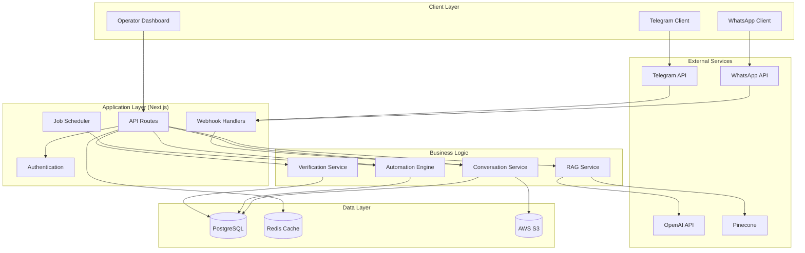
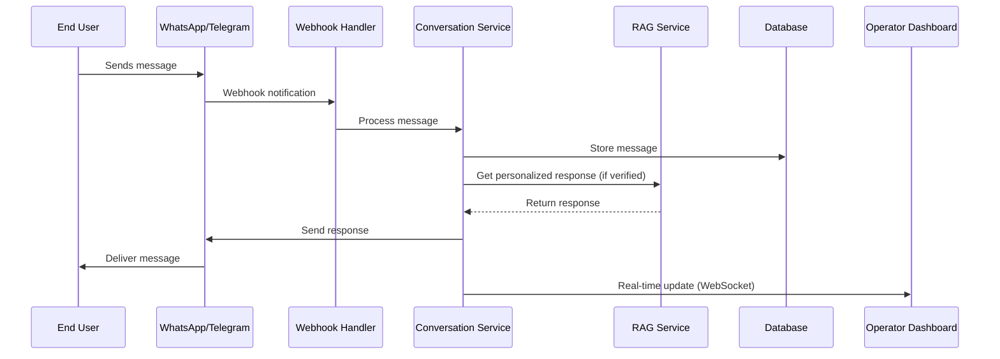
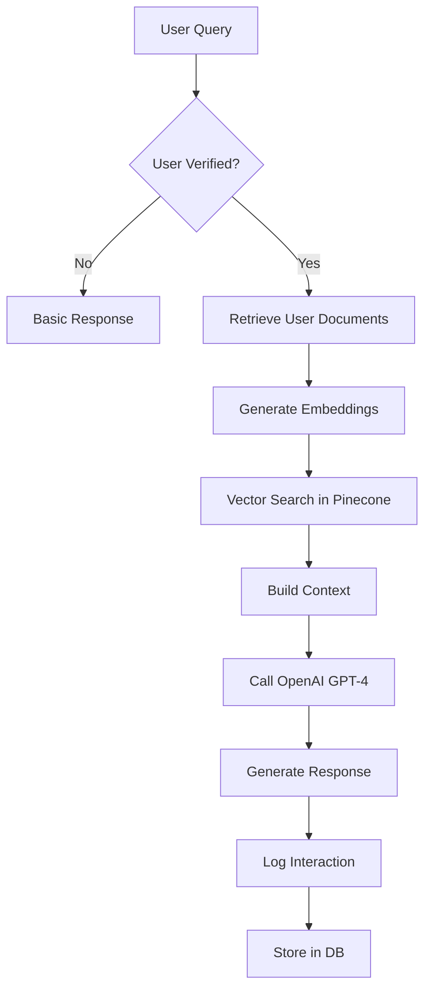

# 🏗️ AIO-CHAT Technical Architecture

> System design and integration approaches for the Conversational AI CRM POC

## Table of Contents

1. [System Overview](#system-overview)
2. [Architecture Diagram](#architecture-diagram)
3. [Component Breakdown](#component-breakdown)
4. [Data Flow](#data-flow)
5. [Security Architecture](#security-architecture)
6. [Messaging Platform Integration](#messaging-platform-integration)
7. [RAG Pipeline Design](#rag-pipeline-design)
8. [Automation Engine](#automation-engine)
9. [Scalability Considerations](#scalability-considerations)
10. [Deployment Architecture](#deployment-architecture)

---

## System Overview

CATBOT-CRM is built on a modern, scalable architecture using Next.js 16 as the full-stack framework. The system integrates multiple messaging platforms with AI-powered personalization and automated workflows.

### Key Architectural Principles

- **API-First**: All functionality exposed through REST APIs
- **Event-Driven**: Message processing and automation triggered by events
- **Microservices-Ready**: Modular design for future scaling
- **Security-First**: End-to-end encryption and PII protection
- **Real-Time**: WebSocket connections for live updates

---

## Architecture Diagram



---

## Component Breakdown

### 1. Frontend (Next.js 16 App Router)

**Technology Stack**:
- **Framework**: Next.js 16 with App Router
- **UI Library**: shadcn/ui + Tailwind CSS
- **State Management**: Zustand (client state) + React Query (server state)
- **Real-time**: WebSocket via Socket.io or Server-Sent Events

**Key Components**:
```tsx
// Operator Dashboard
/apps/web/app/dashboard/
  ├── page.tsx                 # Main dashboard
  ├── conversations/
  │   ├── page.tsx            # Conversation list
  │   └── [id]/
  │       └── page.tsx        # Conversation detail
  ├── users/
  │   └── page.tsx            # User management
  └── metrics/
      └── page.tsx            # System metrics

// API Routes
/apps/web/app/api/
  ├── auth/                   # Authentication endpoints
  ├── users/                  # User management
  ├── conversations/          # Message handling
  ├── webhooks/               # Platform webhooks
  └── admin/                  # Admin operations
```

### 2. Backend Services (API Routes)

#### Authentication Service
```typescript
// /app/api/auth/[...nextauth]/route.ts
export async function POST(request: Request) {
  // NextAuth.js handler
  // Supports multiple auth providers:
  // - Operator credentials (email/password)
  // - Platform OAuth (future)
}
```

#### Conversation Service
```typescript
// /app/api/conversations/route.ts
export async function GET(request: Request) {
  // List conversations with filtering
  // Support: status, platform, date range
}

export async function POST(request: Request) {
  // Create new conversation or send message
  // Trigger RAG if user is verified
}
```

#### Webhook Handlers
```typescript
// /app/api/webhooks/telegram/route.ts
export async function POST(request: Request) {
  const update = await request.json();

  // Verify webhook signature
  // Process message
  // Store in database
  // Trigger bot response
  // Emit real-time update
}
```

### 3. Database Schema (Drizzle ORM)

```typescript
// db/schema.ts
import { pgTable, serial, text, timestamp, boolean, jsonb } from 'drizzle-orm/pg-core';

// Core tables
export const users = pgTable('users', {
  id: serial('id').primaryKey(),
  name: text('name').notNull(),
  email: text('email').unique(),
  phone: text('phone'),
  platformId: text('platform_id'), // WhatsApp number or Telegram ID
  platformType: text('platform_type'), // 'whatsapp' | 'telegram'
  verifiedAt: timestamp('verified_at'),
  policyId: text('policy_id'),
  metadata: jsonb('metadata'),
  createdAt: timestamp('created_at').defaultNow(),
  updatedAt: timestamp('updated_at').defaultNow(),
});

export const conversations = pgTable('conversations', {
  id: serial('id').primaryKey(),
  userId: serial('user_id').references(() => users.id),
  platform: text('platform').notNull(),
  status: text('status'), // 'active' | 'idle' | 'closed'
  metadata: jsonb('metadata'),
  createdAt: timestamp('created_at').defaultNow(),
  updatedAt: timestamp('updated_at').defaultNow(),
});

export const messages = pgTable('messages', {
  id: serial('id').primaryKey(),
  conversationId: serial('conversation_id').references(() => conversations.id),
  content: text('content').notNull(),
  direction: text('direction').notNull(), // 'inbound' | 'outbound'
  platform: text('platform').notNull(),
  platformMessageId: text('platform_message_id'),
  metadata: jsonb('metadata'),
  createdAt: timestamp('created_at').defaultNow(),
});
```

---

## Data Flow

### 1. Message Processing Flow



### 2. RAG Pipeline Flow



---

## Security Architecture

### 1. Authentication & Authorization

```typescript
// Multi-layer security
1. Network Level
   - API rate limiting
   - IP whitelisting for webhooks
   - HTTPS only (TLS 1.3)

2. Application Level
   - NextAuth.js session management
   - JWT tokens with short expiry
   - Role-based access control (RBAC)

3. Data Level
   - PII encryption at rest
   - Database connection encryption
   - Audit logging for all data access
```

### 2. PII Protection Strategy

```typescript
// Sensitive data handling
const piiFields = [
  'phone',
  'email',
  'policyId',
  'platformId'
];

// Encryption before storage
const encryptedPII = {
  phone: encrypt(user.phone, process.env.PII_KEY),
  email: encrypt(user.email, process.env.PII_KEY),
  // ...
};
```

### 3. API Security

```typescript
// Middleware for API protection
export async function requireAuth(request: Request) {
  const token = request.headers.get('authorization');
  const session = await getToken({ token });

  if (!session) {
    throw new Error('Unauthorized');
  }

  return session;
}

// Rate limiting
export const rateLimit = {
  windowMs: 15 * 60 * 1000, // 15 minutes
  max: 100, // limit each IP to 100 requests
};
```

---

## Messaging Platform Integration

### 1. WhatsApp Business API

```typescript
// WhatsApp integration
class WhatsAppAdapter {
  private accessToken: string;
  private phoneNumberId: string;

  async sendMessage(to: string, message: string) {
    const response = await fetch(
      `https://graph.facebook.com/v18.0/${this.phoneNumberId}/messages`,
      {
        method: 'POST',
        headers: {
          'Authorization': `Bearer ${this.accessToken}`,
          'Content-Type': 'application/json',
        },
        body: JSON.stringify({
          messaging_product: 'whatsapp',
          to: to,
          text: { body: message },
        }),
      }
    );

    return response.json();
  }

  async verifyWebhook(body: string, signature: string) {
    // Verify X-Hub-Signature-256
    const expectedSignature = crypto
      .createHmac('sha256', process.env.WHATSAPP_APP_SECRET)
      .update(body)
      .digest('hex');

    return `sha256=${expectedSignature}` === signature;
  }
}
```

### 2. Telegram Bot API

```typescript
// Telegram integration
class TelegramAdapter {
  private botToken: string;
  private apiUrl: string;

  constructor() {
    this.botToken = process.env.TELEGRAM_BOT_TOKEN!;
    this.apiUrl = `https://api.telegram.org/bot${this.botToken}`;
  }

  async sendMessage(chatId: string, text: string) {
    const response = await fetch(`${this.apiUrl}/sendMessage`, {
      method: 'POST',
      headers: { 'Content-Type': 'application/json' },
      body: JSON.stringify({
        chat_id: chatId,
        text: text,
        parse_mode: 'Markdown',
      }),
    });

    return response.json();
  }

  async setWebhook(url: string) {
    return fetch(`${this.apiUrl}/setWebhook`, {
      method: 'POST',
      headers: { 'Content-Type': 'application/json' },
      body: JSON.stringify({
        url: url,
        secret_token: process.env.TELEGRAM_WEBHOOK_SECRET,
      }),
    });
  }
}
```

---

## RAG Pipeline Design

### 1. Document Ingestion

```typescript
// Document processing pipeline
class DocumentProcessor {
  async processDocument(file: File, userId: number) {
    // 1. Extract text from file
    const text = await this.extractText(file);

    // 2. Split into chunks
    const chunks = await this.splitIntoChunks(text);

    // 3. Generate embeddings
    const embeddings = await Promise.all(
      chunks.map(chunk => this.generateEmbedding(chunk))
    );

    // 4. Store in Pinecone
    const vectors = chunks.map((chunk, i) => ({
      id: `${userId}-${Date.now()}-${i}`,
      values: embeddings[i],
      metadata: {
        userId,
        content: chunk,
        fileName: file.name,
      },
    }));

    await this.pinecone.upsert({
      vectors,
      namespace: `user-${userId}`,
    });

    // 5. Store metadata in database
    await db.insert(documents).values({
      userId,
      title: file.name,
      type: file.type,
      chunkCount: chunks.length,
    });
  }
}
```

### 2. Retrieval and Generation

```typescript
// RAG service
class RAGService {
  async generateResponse(query: string, userId: number) {
    // 1. Generate query embedding
    const queryEmbedding = await this.generateEmbedding(query);

    // 2. Search in user's namespace
    const searchResults = await this.pinecone.query({
      vector: queryEmbedding,
      topK: 5,
      namespace: `user-${userId}`,
      includeMetadata: true,
    });

    // 3. Build context
    const context = searchResults.matches
      .map(match => match.metadata?.content)
      .join('\n\n');

    // 4. Generate response with OpenAI
    const completion = await this.openai.chat.completions.create({
      model: 'gpt-4',
      messages: [
        {
          role: 'system',
          content: `You are a helpful assistant. Use only the provided context to answer questions. Context: ${context}`,
        },
        {
          role: 'user',
          content: query,
        },
      ],
      max_tokens: 500,
      temperature: 0.7,
    });

    return completion.choices[0].message.content;
  }
}
```

---

## Automation Engine

### 1. Rules Engine

```typescript
// Automation rule structure
interface AutomationRule {
  id: string;
  name: string;
  conditions: RuleCondition[];
  actions: RuleAction[];
  active: boolean;
}

interface RuleCondition {
  field: string;
  operator: 'eq' | 'ne' | 'gt' | 'lt' | 'in';
  value: any;
}

interface RuleAction {
  type: 'send_message' | 'create_task' | 'update_status';
  params: Record<string, any>;
}

// Rule engine implementation
class AutomationEngine {
  async evaluateRules(userId: number, trigger: string) {
    const rules = await db.query.automationRules.findMany({
      where: eq(automationRules.active, true),
    });

    const user = await this.getUserContext(userId);

    for (const rule of rules) {
      if (await this.evaluateConditions(rule.conditions, user)) {
        await this.executeActions(rule.actions, user);
      }
    }
  }

  private async evaluateConditions(
    conditions: RuleCondition[],
    context: any
  ): Promise<boolean> {
    return conditions.every(condition => {
      const value = this.getNestedValue(context, condition.field);

      switch (condition.operator) {
        case 'eq': return value === condition.value;
        case 'gt': return value > condition.value;
        case 'in': return condition.value.includes(value);
        // ... other operators
      }
    });
  }
}
```

### 2. Job Scheduler

```typescript
// Scheduled tasks with Bull Queue
import { Queue, Worker } from 'bullmq';

// Create queues
const reminderQueue = new Queue('reminders');
const broadcastQueue = new Queue('broadcasts');

// Schedule daily payment reminders
const dailyReminderJob = cron.schedule('0 9 * * *', async () => {
  // Find users with due payments
  const overdueUsers = await db.query.users.findMany({
    where: and(
      eq(users.verifiedAt, sql`${sql.placeholder('now')} - interval '30 days'`),
      // Payment due logic
    ),
  });

  // Queue reminders with throttling
  for (const user of overdueUsers) {
    await reminderQueue.add(
      'send-reminder',
      { userId: user.id, type: 'payment-due' },
      {
        delay: Math.random() * 3600000, // Random delay within hour
        attempts: 3,
        backoff: 'exponential',
      }
    );
  }
});
```

---

## Scalability Considerations

### 1. Database Optimization

```sql
-- Indexes for performance
CREATE INDEX idx_messages_conversation_created
ON messages(conversation_id, created_at);

CREATE INDEX idx_users_platform
ON users(platform_type, platform_id);

CREATE INDEX idx_conversations_user_status
ON conversations(user_id, status);

-- Partitioning for large tables (future)
CREATE TABLE messages_2024 PARTITION OF messages
FOR VALUES FROM ('2024-01-01') TO ('2025-01-01');
```

### 2. Caching Strategy

```typescript
// Redis caching layers
const cacheKeys = {
  user: (id: number) => `user:${id}`,
  conversations: (userId: number) => `conversations:${userId}`,
  messageCount: (convId: number) => `msg-count:${convId}`,
};

// Cache middleware
export async function cachedQuery<T>(
  key: string,
  query: () => Promise<T>,
  ttl: number = 300
): Promise<T> {
  const cached = await redis.get(key);

  if (cached) {
    return JSON.parse(cached);
  }

  const result = await query();
  await redis.setex(key, ttl, JSON.stringify(result));

  return result;
}
```

### 3. Real-time Updates

```typescript
// WebSocket broadcasting
import { Server } from 'socket.io';

const io = new Server(server);

io.on('connection', (socket) => {
  // Join operator rooms
  socket.on('join-operator-room', (operatorId) => {
    socket.join(`operator:${operatorId}`);
  });

  // Join conversation rooms
  socket.on('join-conversation', (conversationId) => {
    socket.join(`conversation:${conversationId}`);
  });
});

// Broadcast new message
export function broadcastNewMessage(message: Message) {
  io.to(`conversation:${message.conversationId}`)
    .emit('new-message', message);

  // Notify operators if human intervention needed
  if (message.requiresHuman) {
    io.emit('conversation-needs-attention', {
      conversationId: message.conversationId,
    });
  }
}
```

---

## Deployment Architecture

### 1. Container Strategy

```dockerfile
# Dockerfile for Next.js app
FROM node:20-alpine AS base

# Dependencies
FROM base AS deps
WORKDIR /app
COPY package.json pnpm-lock.yaml ./
RUN corepack enable pnpm && pnpm install --frozen-lockfile

# Build
FROM base AS builder
WORKDIR /app
COPY --from=deps /app/node_modules ./node_modules
COPY . .
ENV NEXT_TELEMETRY_DISABLED 1
RUN npm run build

# Runner
FROM base AS runner
WORKDIR /app
ENV NODE_ENV production
ENV NEXT_TELEMETRY_DISABLED 1

RUN addgroup --system --gid 1001 nodejs
RUN adduser --system --uid 1001 nextjs

COPY --from=builder /app/public ./public
COPY --from=builder --chown=nextjs:nodejs /app/.next/standalone ./
COPY --from=builder --chown=nextjs:nodejs /app/.next/static ./.next/static

USER nextjs

EXPOSE 3000
ENV PORT 3000

CMD ["node", "server.js"]
```

### 2. Docker Compose (Development)

```yaml
# docker-compose.yml
version: '3.8'

services:
  app:
    build: .
    ports:
      - "3000:3000"
    environment:
      - DATABASE_URL=postgresql://postgres:password@db:5432/aio_chat
      - REDIS_URL=redis://redis:6379
    depends_on:
      - db
      - redis

  db:
    image: postgres:15-alpine
    environment:
      POSTGRES_DB: aio_chat
      POSTGRES_USER: postgres
      POSTGRES_PASSWORD: password
    volumes:
      - postgres_data:/var/lib/postgresql/data
    ports:
      - "5432:5432"

  redis:
    image: redis:7-alpine
    ports:
      - "6379:6379"
    volumes:
      - redis_data:/data

volumes:
  postgres_data:
  redis_data:
```

### 3. Production Deployment

```yaml
# kubernetes/deployment.yaml
apiVersion: apps/v1
kind: Deployment
metadata:
  name: aio-chat
spec:
  replicas: 3
  selector:
    matchLabels:
      app: aio-chat
  template:
    metadata:
      labels:
        app: aio-chat
    spec:
      containers:
      - name: aio-chat
        image: aio-chat:latest
        ports:
        - containerPort: 3000
        env:
        - name: DATABASE_URL
          valueFrom:
            secretKeyRef:
              name: aio-chat-secrets
              key: database-url
        resources:
          requests:
            memory: "256Mi"
            cpu: "250m"
          limits:
            memory: "512Mi"
            cpu: "500m"
```

---

## Monitoring & Observability

### 1. Application Metrics

```typescript
// Prometheus metrics collection
import { register, counter, histogram, gauge } from 'prom-client';

const messageCounter = counter({
  name: 'messages_total',
  help: 'Total number of messages processed',
  labelNames: ['platform', 'direction'],
});

const responseTime = histogram({
  name: 'api_response_time_seconds',
  help: 'API response time in seconds',
  labelNames: ['endpoint'],
});

const activeConversations = gauge({
  name: 'active_conversations_total',
  help: 'Number of active conversations',
});

// Export metrics endpoint
export async function GET() {
  return new Response(await register.metrics(), {
    headers: { 'Content-Type': register.contentType },
  });
}
```

### 2. Error Tracking

```typescript
// Error logging with context
import { logger } from './logger';

export class AppError extends Error {
  constructor(
    message: string,
    public code: string,
    public statusCode: number = 500,
    public context?: any
  ) {
    super(message);
    this.name = 'AppError';

    logger.error('Application error', {
      message,
      code,
      statusCode,
      context,
      stack: this.stack,
    });
  }
}

// Global error handler
export function handleGlobalError(error: Error) {
  if (error instanceof AppError) {
    // Known application error
    return error;
  }

  // Unknown error - log full details
  logger.error('Unhandled error', {
    message: error.message,
    stack: error.stack,
  });

  return new AppError('Internal server error', 'INTERNAL_ERROR');
}
```

---

**Document Version**: 1.0 (POC)
**Last Updated**: December 6, 2025
**Architecture Status**: Designed but not implemented

This architecture provides a solid foundation for the CATBOT-CRM POC while being flexible enough to scale to production requirements.